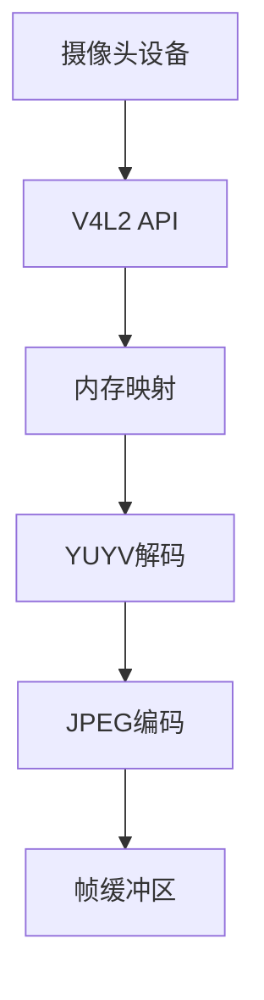
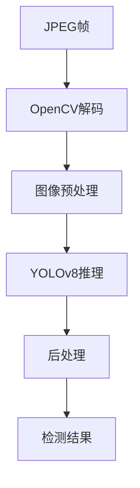
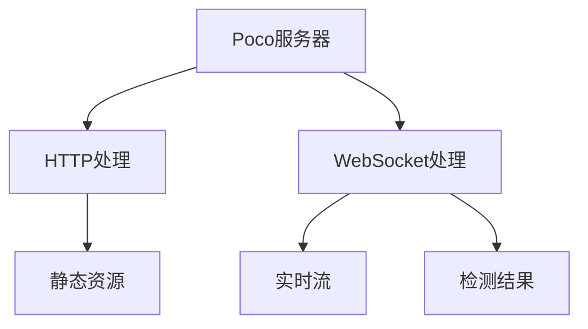
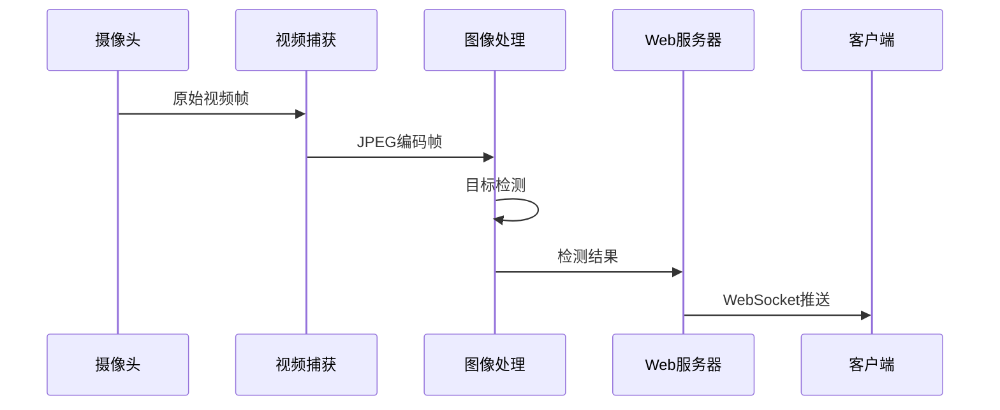

# 架构设计文档

## 系统总体架构

本系统采用模块化设计，主要分为三大核心模块：

### 1. 视频捕获模块 (V4L2Capture)



#### 关键特性
- 使用MMAP实现零拷贝
- 支持YUYV格式
- 实时JPEG压缩
- 线程安全设计

### 2. 图像处理模块 (ImageProcessor)



#### 关键特性
- YOLOv8目标检测
- ONNX Runtime加速
- 异步处理设计
- 可配置参数

### 3. Web服务器模块 (WebServer)



#### 关键特性
- 基于Poco框架
- WebSocket实时传输
- JSON通信协议
- 二进制流处理

## 数据流



## 模块接口

### 视频捕获接口
```cpp
class CaptureInterface {
    virtual bool start(int device_id = 0);
    virtual void stop();
    virtual std::string getLatestFrame();
};
```

### 图像处理接口
```cpp
class ImageProcessor {
    std::vector<DetectionResult> processFrame(const cv::Mat& frame);
    void setDetectionEnabled(bool enabled);
    void setConfidenceThreshold(float threshold);
};
```

### Web服务器接口
```cpp
class WebServer {
    void start(int port = 8080);
    void stop();
};
```

## 关键技术实现

### 1. 内存管理
- 使用MMAP实现零拷贝
- 智能指针管理资源
- 线程安全的帧缓冲

### 2. 并发控制
- 互斥锁保护共享资源
- 条件变量实现同步
- 原子操作避免竞争

### 3. 性能优化
- SIMD加速图像处理
- 内存池复用
- 延迟加载 